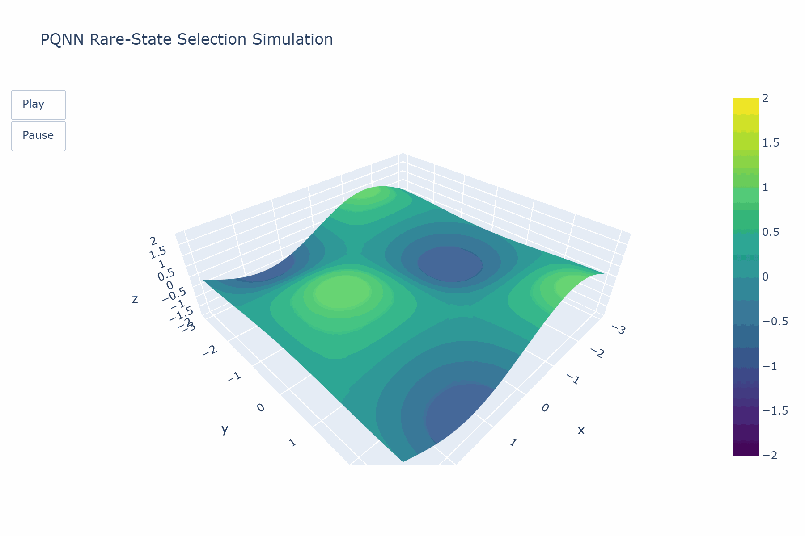

# PQNN Rare-State Selection Simulation

This repository contains a dynamic simulation that visualizes **Post-Quantum Neural Network (PQNN)** rare-state selection.  
The model demonstrates how PQNN reshapes the amplitude landscape so that rare quantum states become **energetically favorable**, **topologically accessible**, and **feedback-reinforced** — rather than relying on probabilistic emergence alone.

The included HTML file is an interactive Plotly animation showing amplitude packets evolving across a reshuffling manifold, guided by curvature-sensitive attractors.

---

## 📜 Background

In standard quantum mechanics, the **Born rule** governs the probability distribution of measurement outcomes.  
PQNN introduces a post-Born mechanism that actively **engineers the geometry and dynamics** of the state space to amplify rare states.

Key concepts illustrated in this simulation:
- **Reshuffling manifold**: Alters amplitude flow pathways
- **Curvature bias**: Guides trajectories toward attractor basins
- **Feedback loops**: Reinforce low-probability configurations
- **Temporal dynamics**: Shows how rare states emerge over time

---

## 📂 Repository Contents

- `quantum_amplitude_reshuffling_simulation.html`  
  Interactive 3D Plotly animation — open in any modern browser.
- *(Optional)* `pqnn_simulation.ipynb`  
  Google Colab-ready notebook to run and modify the simulation.
- `simulation.gif`  
  Animated preview of the simulation (see below).
- `README.md`  
  Project documentation (this file).

---

## 🚀 How to Use

### View the Simulation
1. Download `quantum_amplitude_reshuffling_simulation.html`
2. Open it in your browser
3. Use the **Play** button or slider to watch amplitude evolution

### Run in Google Colab
1. Open the Colab notebook (if provided)  
2. Run all cells to generate the animation dynamically  
3. Modify parameters to explore different PQNN behaviors

---

## 📊 Example Visualization

---

## 📚 Citation

If you use this simulation in academic work, please cite:

Edward Meisner, "PQNN Rare-State Selection Simulation", GitHub repository, 2025. Available at:

# PQNN Rare-State Selection Simulation

This repository contains a dynamic simulation that visualizes **Post-Quantum Neural Network (PQNN)** rare-state selection.  
The model demonstrates how PQNN reshapes the amplitude landscape so that rare quantum states become **energetically favorable**, **topologically accessible**, and **feedback-reinforced** — rather than relying on probabilistic emergence alone.

The included HTML file is an interactive Plotly animation showing amplitude packets evolving across a reshuffling manifold, guided by curvature-sensitive attractors.

---

## 📜 Background

In standard quantum mechanics, the **Born rule** governs the probability distribution of measurement outcomes.  
PQNN introduces a post-Born mechanism that actively **engineers the geometry and dynamics** of the state space to amplify rare states.

Key concepts illustrated in this simulation:
- **Reshuffling manifold**: Alters amplitude flow pathways
- **Curvature bias**: Guides trajectories toward attractor basins
- **Feedback loops**: Reinforce low-probability configurations
- **Temporal dynamics**: Shows how rare states emerge over time

---

## 📂 Repository Contents

- `quantum_amplitude_reshuffling_simulation.html`  
  Interactive 3D Plotly animation — open in any modern browser.
- *(Optional)* `pqnn_simulation.ipynb`  
  Google Colab-ready notebook to run and modify the simulation.
- `simulation.gif`  
  Animated preview of the simulation (see below).
- `README.md`  
  Project documentation (this file).

---

## 🚀 How to Use

### View the Simulation
1. Download `quantum_amplitude_reshuffling_simulation.html`
2. Open it in your browser
3. Use the **Play** button or slider to watch amplitude evolution

### Run in Google Colab
1. Open the Colab notebook (if provided)  
2. Run all cells to generate the animation dynamically  
3. Modify parameters to explore different PQNN behaviors

---

## 📊 Example Visualization

---

## 📚 Citation

If you use this simulation in academic work, please cite:


Edward Meisner, "PQNN Rare-State Selection Simulation", GitHub repository, 2025. Available at: https://github.com/EMCopilotgit/pqnn_simulation

---

## 📜 License

This project is licensed under the MIT License — see the [LICENSE](LICENSE) file for details.

---

## 🤝 Contributing

Contributions are welcome!  
Feel free to fork the repo, submit pull requests, or open issues for:
- Feature requests
- Bug reports
- Theoretical extensions

---

## 🔗 Links

- **GitHub Repository**: [pqnn_simulation](https://github.com/EMCopilotgit/pqnn_simulation)
- **Colab Notebook**: *(link if available)*
- **Related Paper**: *(link if available)*

---

*This simulation is part of ongoing research into post-Born quantum probability models and neural-network-inspired quantum state engineering.*



